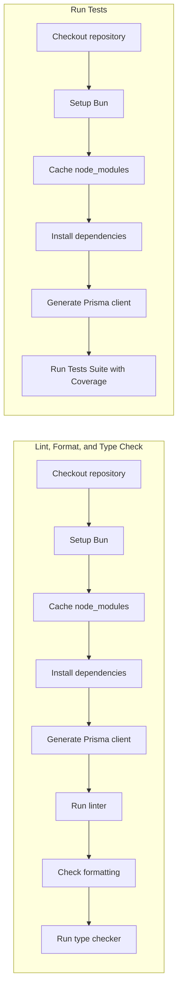
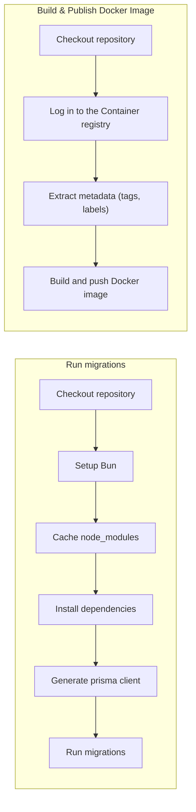

<div align="center">
	
</div>

# Eteg - Sistema de Cadastro de Clientes

Um formulário simples de registro de clientes construído com Next.js, React, Tailwind CSS, Prisma e PostgreSQL.

> [!IMPORTANT]
>
> - **Live Demo**: [`https://eteg-production.up.railway.app`](https://eteg-production.up.railway.app/)
> - **Imagem Docker Oficial**: [`ghcr.io/nivaldofarias/eteg`](https://github.com/nivaldofarias/eteg/pkgs/container/eteg)

<div align="center">

[](https://github.com/NivaldoFarias/eteg/actions/workflows/ci.yml)
[](https://eteg-production.up.railway.app/api/health/ready)

[](https://www.typescriptlang.org/)
[](https://nextjs.org/)
[](https://reactjs.org/)
[](https://bun.sh/)
[](https://www.docker.com/)
[](https://tailwindcss.com/)
[](https://www.prisma.io/)
[](https://www.postgresql.org/)

</div>

## Stack

- **Frontend**: Next.js 16, React 19, Tailwind CSS v4, ShadCN UI
- **Backend**: Next.js API Routes, Prisma ORM v7
- **Database**: PostgreSQL v17
- **Runtime**: Bun v1.3

## Iniciando

### Desenvolvimento

#### Pré-requisitos

- [Bun](https://bun.sh/): v1.3+ _(versão mais recente)_
- [Docker](https://www.docker.com/) v28.x+
- [PostgreSQL](https://www.postgresql.org/): v17.x+ _(local ou via Docker)_

#### Passo-a-passo

1. Instale as dependências: `bun install`
2. Inicie o PostgreSQL.
   2.1. Localmente: `sudo service postgresql start`
   2.2. Via Docker: `bun run docker:up`
3. Caso esteja rodando localmente, configure o banco de dados e as variáveis de ambiente:
   3.1. Crie o banco de dados `eteg`: `createdb eteg`
   3.2. Copie o arquivo de variáveis de ambiente: `cp .env.example .env`
   3.3. Edite o arquivo `.env` para ajustar as credenciais do banco de dados, se necessário:
4. Execute as migrações do banco de dados: `bun run db:migrate`
5. Inicie o servidor de desenvolvimento: `bun run dev`

Abra [http://localhost:3000](http://localhost:3000) para ver a aplicação rodando.

## Uso da Aplicação

### Formulário de Cadastro

O formulário de cadastro de clientes está disponível na página principal da aplicação. Para cadastrar um novo cliente:

1. **Nome Completo**: Digite o nome completo do cliente (mínimo 2 caracteres)
2. **CPF**: Digite o CPF do cliente
3. **Email**: Digite um endereço de email válido
4. **Cor Favorita**: Selecione uma das cores do arco-íris no dropdown
5. **Observações** (opcional): Adicione notas adicionais sobre o cliente
6. Clique em **Enviar Cadastro**

### Validações

O formulário realiza validação em tempo real:

- **CPF**: Deve ser um CPF brasileiro válido (verificação de dígitos)
- **Email**: Deve ser um formato de email válido e único no sistema
- **Campos obrigatórios**: Nome, CPF, Email e Cor Favorita são obrigatórios

### Mensagens de Erro

- **Dados inválidos**: Erros de validação são exibidos abaixo de cada campo
- **CPF/Email duplicado**: Mensagem de erro indica qual campo já está cadastrado
- **Erro de servidor**: Mensagem genérica solicitando nova tentativa

### Sucesso

Após cadastro bem-sucedido:

- Uma notificação de sucesso é exibida
- O formulário é limpo automaticamente
- O cliente é persistido no banco de dados

## Scripts

### Scripts Essenciais

Nesta tabela, listamos apenas os scripts mais essenciais para o desenvolvimento e manutenção do projeto.

| Comando               | Descrição                                                                  |
| --------------------- | -------------------------------------------------------------------------- |
| `bun run dev`         | Inicia servidor de desenvolvimento                                         |
| `bun run build`       | Build completo da aplicação Next.js para produção                          |
| `bun run start`       | Inicia servidor de produção                                                |
| `bun run format`      | Executa Prettier                                                           |
| `bun run lint`        | Executa ESLint                                                             |
| `bun run type-check`  | Executa verificação de tipagens TypeScript                                 |
| `bun run test`        | Executa a suite de testes                                                  |
| `bun run test:watch`  | Executa testes em modo watch                                               |
| `bun run db:generate` | Gera cliente Prisma a partir do schema                                     |
| `bun run db:migrate`  | Executa migrações do banco _(exige que `DATABASE_URL` esteja configurada)_ |
| `bun run docker:up`   | Inicia containers de desenvolvimento local                                 |
| `bun run docker:down` | Para containers de desenvolvimento local                                   |

### Scripts Avançados

| Comando                     | Descrição                                                                                                           |
| --------------------------- | ------------------------------------------------------------------------------------------------------------------- |
| `bun run dev:webpack`       | Inicia servidor de desenvolvimento com Webpack ao invés do Turbopack                                                |
| `bun run db:studio`         | Abre Prisma Studio                                                                                                  |
| `bun run format:check`      | Executa verificação do formato do código _(Prettier)_                                                               |
| `bun run test:quiet`        | Executa a suite de testes em modo menos verboso                                                                     |
| `bun run test:coverage`     | Executa a suite de testes, extraindo dados de cobertura de código                                                   |
| `bun run db:migrate:deploy` | Executa migrações do banco em ambiente de produção                                                                  |
| `bun run docker:up:build`   | Re-constrói imagens Docker e inicia containers                                                                      |
| `bun run docker:logs`       | Exibe logs dos containers Docker rodando atualmente                                                                 |
| `bun run docker:up:prod`    | Inicia container Next.js em modo de produção _(veja [`docker-compose.prod.yml`](./docker/docker-compose.prod.yml))_ |
| `bun run docker:down:prod`  | Para containers Docker em modo de produção                                                                          |
| `bun run docker:logs:prod`  | Exibe logs dos containers Docker em modo de produção                                                                |

### Scripts Auxiliares

| Comando                       | Descrição                                                                       |
| ----------------------------- | ------------------------------------------------------------------------------- |
| `bun run docker-compose`      | Comando auxiliar Docker Compose _(usa `docker-compose.yml`)_                    |
| `bun run docker-compose:prod` | Comando auxiliar Docker Compose para produção _(usa `docker-compose.prod.yml`)_ |

## Schema do Banco de Dados

### Tabela Customer

| Campo           | Tipo                 | Descrição                                   |
| --------------- | -------------------- | ------------------------------------------- |
| `id`            | `String` (CUID)      | Chave primária                              |
| `fullName`      | `String`             | Nome completo do cliente (2-255 caracteres) |
| `cpf`           | `String` (único)     | CPF (11 dígitos)                            |
| `email`         | `String` (único)     | Endereço de email                           |
| `favoriteColor` | `FavoriteColor` enum | Uma das cores do arco-íris                  |
| `observations`  | `String?`            | Notas opcionais (máx 1000 caracteres)       |
| `createdAt`     | `DateTime`           | Timestamp do cadastro                       |

### Enum `FavoriteColor`

`RED` | `ORANGE` | `YELLOW` | `GREEN` | `BLUE` | `INDIGO` | `VIOLET`

## Referência da API

### POST `/api/customers`

Cria um novo registro de cliente.

#### Corpo da Solicitação

```json
{
	"fullName": "João Silva",
	"cpf": "529.982.247-25",
	"email": "joao@example.com",
	"favoriteColor": "BLUE",
	"observations": "Notas opcionais"
}
```

| Campo           | Tipo     | Obrigatório | Descrição                                                |
| --------------- | -------- | ----------- | -------------------------------------------------------- |
| `fullName`      | `string` | Sim         | 2-255 caracteres                                         |
| `cpf`           | `string` | Sim         | CPF válido                                               |
| `email`         | `string` | Sim         | Endereço de email válido                                 |
| `favoriteColor` | `string` | Sim         | Uma de: RED, ORANGE, YELLOW, GREEN, BLUE, INDIGO, VIOLET |
| `observations`  | `string` | Não         | Máx 1000 caracteres                                      |

#### Respostas

##### `201` **Created** - Cliente registrado com sucesso

```json
{
	"success": true,
	"data": {
		"id": "clx1234567890",
		"fullName": "João Silva",
		"email": "joao@example.com",
		"favoriteColor": "BLUE",
		"createdAt": "2026-01-09T00:00:00.000Z"
	}
}
```

##### `400` **Bad Request** - Erro de validação

```json
{
	"success": false,
	"error": "VALIDATION_ERROR",
	"message": "CPF é inválido"
}
```

##### `409` **Conflict** - CPF ou email duplicado

```json
{
	"success": false,
	"error": "DUPLICATE_ENTRY",
	"message": "Um cliente com este CPF já existe"
}
```

##### `500` **Internal Server Error** - Erro de servidor

```json
{
	"success": false,
	"error": "INTERNAL_ERROR",
	"message": "Ocorreu um erro inesperado. Tente novamente mais tarde."
}
```

### Variáveis de Ambiente

| Variável            | Padrão                                             | Descrição                 |
| ------------------- | -------------------------------------------------- | ------------------------- |
| `DATABASE_URL`      | `postgresql://eteg:eteg_dev_password@db:5432/eteg` | URL de conexão PostgreSQL |
| `NODE_ENV`          | `development`                                      | Ambiente de execução      |
| `DATABASE_NAME`     | `eteg`                                             | Nome do banco de dados    |
| `DATABASE_USER`     | `eteg`                                             | Usuário do banco          |
| `DATABASE_PASSWORD` | `eteg_dev_password`                                | Senha do banco            |

## CI/CD

Este projeto possui integração contínua (CI) e entrega contínua (CD) configuradas via GitHub Actions.

### Integração Contínua (CI)

A pipeline de CI é definida em [`ci.yml`](.github/workflows/ci.yml) e inclui os seguintes fluxos paralelos:



### Entrega Contínua (CD)

A pipeline de CD é definida em [`cd.yml`](.github/workflows/cd.yml) e inclui os seguintes fluxos:


